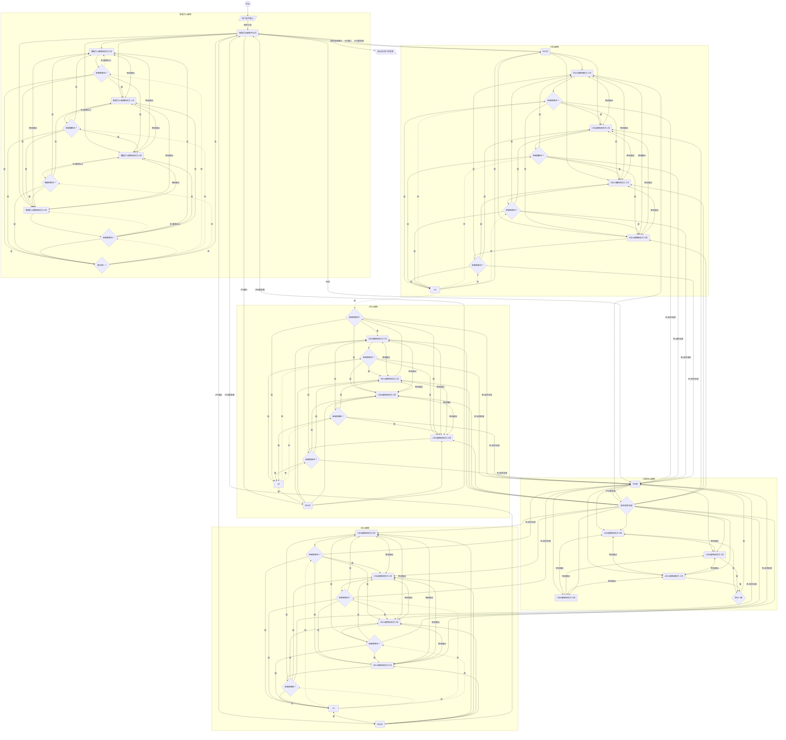
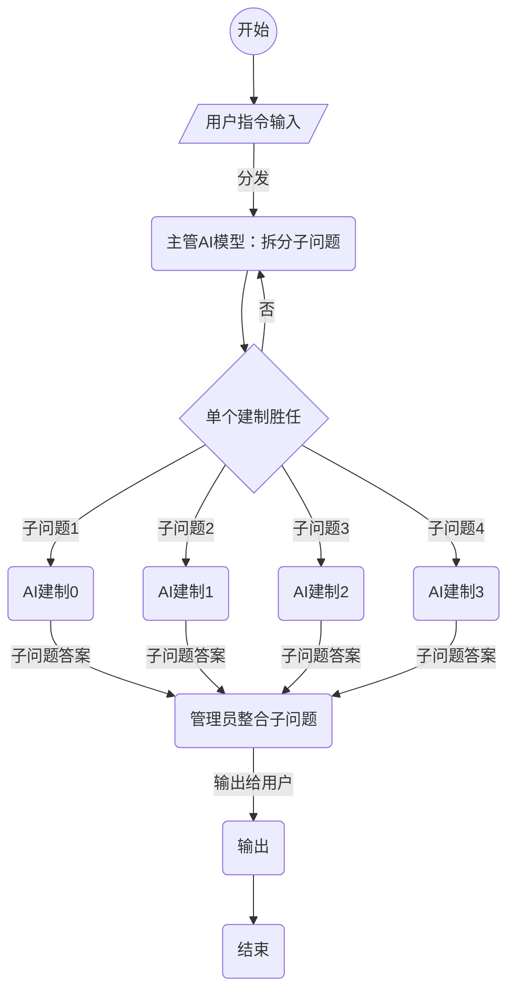
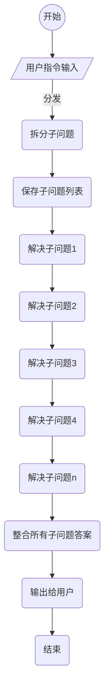
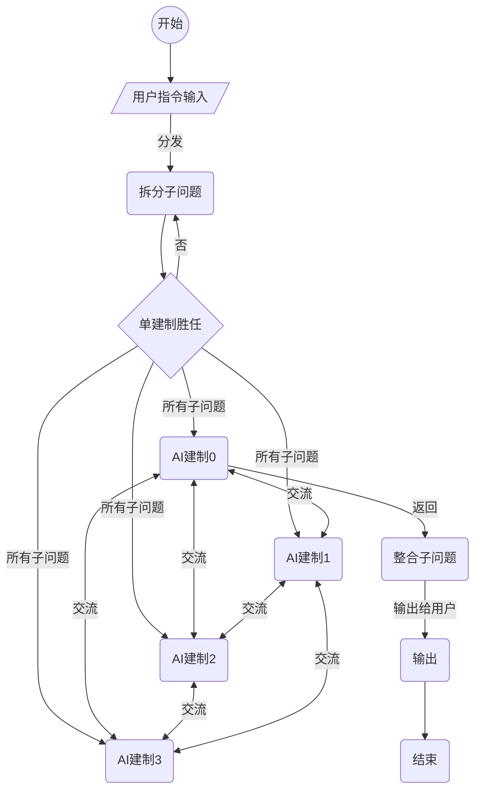
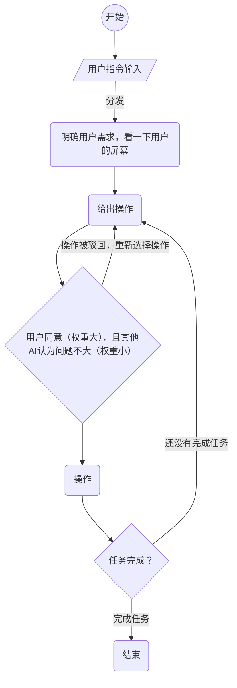

# super-massive-enormous-AI-cooperation-model
# **`项目介绍`** #
## 目录 ##
>**`一. 设计“万千大模型协同工作”原理及实现方法`**

>**`二. AI智能体操作电脑`**

>**`三. 开发控制AI模型群的编程语言`**

>**`四. 如何有效地控制AI模型，防止AI毁灭人类的事情出现(只是一个讨论，欢迎加入！)`**
## 概念界定 ##
## `1. 用户问题拆分` ##
> <u> **`用户问题拆分`** </u>指的是模型接收到的问题可用拆分法(比如递归或者迭代)，把问题拆分成子问题或子问题的子问题等；递归深度取决于问题或任务的复杂程度、已拥有的资源数量等因素。
比如：如何给中穆拉玛峰加装电梯？
      子问题：中穆拉玛峰的地理位置？
              下面的地基是什么土？
               电梯要分几段修工程量最小？
                需要修多久？
                  总花费？
            。。。。。。。
你甚至可以让他给你做一个关于如何给太平洋装个锅盖！
## `2. 单个AI建制` ##
><u> **`单个AI建制`** </u>是由多个AI智能体构成的讨论或任务完成单位，有一个主持分发问题的AI书记员智能体，一群AI研究员智能体（本文档中拿这个组成的建制来进行举例，其实一个建制里面的角色并不唯一，你可以自由地添加或者删减AI角色），一切以设计者为准！`impossible is nothing!`
## `3. 申请支援` ##
><u> **`申请支援`** </u>指的是如果子问题被评估为这个建制可以胜任，但是其衍生的子问题难以解决，那么可以由AI研究员去联系另一个没有任务的空闲建制完成这个规模较大的衍生子任务。完成任务之后把结果反馈给这个AI研究员，再由这个AI研究员进行上报。
<br>


# **`一. 设计“万千大模型协同工作”原理及实现方法`** #
## `（一）核心理念` ##

><u>**`0.AI只能解决具体的，具象的任务，那就把宏大的、抽象的任务变成细小的、具体的任务`**</u>

><u>**`1.人多力量大，团结就是力量！（大量AI协同工作）`**</u>

><u>**`2.集百家之长，集体大于个人！（AI合作，集体知识大于个体知识）`**</u>

><u>**`3.问题微积分，先微分再积分：解决任何问题，完成任何任务！（拆分问题，解决问题）`**</u>

><u>**`4.灵活机动，任意操作（想要发明的AI编程语言）`**</u>

## `（二）以下是一种实现方法（只是一种实现方法而已）` ##
### **`1.一种部署方法描述（方法1——递归）`**
>用户对一个GUI提出问题或任务；问题或任务由一个或几个主管AI模型或者主管AI建制拆分成子问题或子任务；在拆分完问题之后应评估自己能控制的AI建制的规模和问题的规模，尽量保证单独AI建制在解决子问题时不向其他建制申请支援。

>拆分完成后有几个问题就向几个AI建制发送子问题或子任务，对于给定的子问题或子任务，AI书记员将问题分发给每一个AI研究员。

>每个AI研究员收到问题后，都给出自己的答案。接下来给每一个AI研究员看其他的AI研究员的答案，让其对他们的答案做出修改意见和点评（就相当于两两互评）。最后，每一个AI研究员将会收到所有其他的AI研究员对自己的回答的修改意见，进行修改，然后根据问题的体量、每个AI研究员的相关计算资源来重复执行上述步骤，直到所有AI研究员的意见一致。

>结束后，AI书记员检查并汇总所有AI研究员给出的最后答案，汇报给给自己布置任务的上级主管AI。经逐级汇总上报后，最终由主管AI输出给用户。
>其实要是想让它更强大，还可以加入智能体之间互相访问的功能，具体的我流程图中就不画了，能加的功能太多了！
### **`2.详细流程图`** ###
>`特此说明，N号空闲AI建制也可以申请支援，但是因为这样下去图太复杂所以我选择把N号AI建制的这一部分删掉，其实这里面的所有AI建制的组成都是一样的！`

<br>

### **`3.精简流程图`** ###
>毕竟是精简流程图，所以申请支援就被我省掉了。

<br>

### **`3.详细实施办法示例`** ###
>可以申请很多deepseek 的API、各种AI模型的API、本地部署很多个独立的模型，告诉模型群所要执行的任务。比如上级AI主管给下级AI书记们分派任务；下级各个AI书记给自己建制内AI研究员们分派子问题或者任务。

>  <u>**`这可以是一段可给主管AI的提示词：`**</u>

用户提出的问题如下：XXX。你需要把这个问题拆分成几个子问题，子问题的难度要让你手下的单个AI建制能够独立完成，在拆分完之后，把子问题做成一个JSON的形式输出。样例如下：
```json
{
"讨论小组":"1号" ,
"问题":"子问题一",
"讨论小组":"2号",
"问题":"子问题2"
}
```
 这样的形式，然后把你输出好的形式输出出来，由我们的程序接收。之后你会收到子问题的答案，形式如：
``` json
{
"讨论小组":"1号",
"问题":"子问题",
"答案":"子问题答案"
}
```
的JSON回复，把这些问题的答案整合，形成我们最后回复给用户的形式，在回复之前检查一遍，有明显逻辑问题自己修改。

（这个不能代替具体实现，只是他大致要做的事罢了）
## **`（三）重要备注`** ##
> **`这个想法的核心并不是上面的对于AI的部署，其实有很多种部署方案，上述的是一种我认为比较强大的递归法。这个想法的精髓是————利用多个AI，按照一定的顺序和逻辑，采取多轮或者单轮行动，解决复杂问题或完成复杂任务，部署机动性强，集体智慧大于个人智慧！`**

> **`你有的是：一大群可以由你操作的AI智能体，没有任何其他限制！他们可以自由的组队！执行任何你想让他们执行的任务，按照任何逻辑工作！AI部门！`**

>**`你要是资源不够，也可以采用迭代法等方法，比如让一个AI建制输出子问题列表，然后逐个解决，总结并输出（方法2——迭代）。`**

>**`或者让一个AI建制依次输出所有子问题的答案，然后再交流子问题答案。(方法3——并行操作，更加全面)`**

>**`一切都由设计者来决定！`**

>**`人有多大胆，AI多大产！`**
<br>

### **`方法2精简流程图`** ###


### **`方法3精简流程图`** ###


## **`（四）研究方向`** ##
   - ### **研究AI的讨论方式，讨论顺序，逻辑等**
   - ### **研究AI控制算法的相关性质、功能，以及适用场景**
   - ### **研究多AI所组成的社会协作的运作规律**
   - ### **…………**
<br>

### **` 欢迎研究社会学和逻辑学的同志们提出更加好的方案！`** ###
<br>

### **` 同样欢迎研究算法的同志们评估每一种AI协作策略的时间复杂度？AI数量复杂度？使用范围？最差效率？平均效率？能研究的东西很多.`** ###
<br>

### **` 能研究的东西很多.`** ###
<br>

## **`我在开创一个新的学科！`** ##

## **`想加入开发的同志欢迎issue或者邮件找我！`** ##

## **`要是你觉得我没什么实力，想自己开发，也行，允许fork，伤心了（悲）`** ##

<br>

## **`（五）这个想法可能遇到的问题`** ##
>### 1.AI智能体的数量巨大，难以操作，出了问题难以查找。

>### 2.AI智能体容易被错误信息误导。

>### 3.问题的复杂程度太大，导致递归深度过大导致运行时间过长。

>### 4.AI管理员最后疑神疑鬼瞎修改。

>### 5.个别AI的权利过大，决策失误导致重大问题

>### 6.集体智慧过大，做出人类无法理解的决策。

>### 7.所以他们的集体智慧是会比个体智慧大的，但是是怎么个大法？是及其智慧（按照人类逻辑的智慧）还是另一种我们根本无法理解的智慧?。

## **`（六）问题的解决方法`** ##
>### 1.下文要说的，开发一种新的编程语言！

>### 2.设置专门用于鉴别信息的AI建制！

>### 3.设置资源使用上限，不让对方服务器或的本地部署模型的电脑崩溃。如果说你的问题规模很大，但是很有意义，那么我认为多花一些资源去解决是值得和应该的，不是吗？

>### 4.多找几个管理员，或者直接调一个建制的AI来做管理员。

>### 5.~~一切权利，归苏维埃！设置AI代表大会和法院！~~（可操作性不强）或者在程序中规定每个AI的权限，和作用域，明确责任义务！

>### 6.可以属于最后一部分的讨论内容。（好问题！）

>### 7.不管是哪一种，我们都看不懂，但是这关系到我们是否可以在一定程度下预测他们的行为。（举个例子：你跟他下国际象棋，他是会正常出子战胜你，是一个永远不会犯错的人类大师，还是先弃少量子力来获取有利位置，还是直接弃光所有子力，变魔法似的用一个兵把你将死？）

<br>

<br>

# **`二. AI智能体操作电脑`** #
## `（一）核心理念` ##
> ### <u>**`1.AI操作图形化界面，又快又好，多快好省，速度百倍！`**</u>

> ### <u>**`2.知识面广，任意软件，都能操作`**</u>

## **`（二）一种实践方法（只是一种）`** ##
>### 让AI拥有`操作电脑的能力`，这样他们就能直接参与到人类的生产建设中了。可以只是作为辅助，也可以把一些低端的任务`直接外包`给他们。

>### 现在的AI基本都有`完善的识别图片的功能`，可开发一个`让AI操作计算机软件`，告诉这个智能体你的需求，然后让这个程序`接管你的鼠标和键盘`。

>### 这个程序智能体的功能：将电脑屏幕的截屏传送给一个或多个建制的AI模型，这一群AI模型经过讨论之后把需要进行的操作以JSON的形式传回来（AI研究员讨论，AI书记员记录并上报）。比如`点击使用鼠标点击显示屏上（npx，mpx）的像素点`，或者`输入什么内容`之类的。传回来之后，这个程序会征询用户的意见，`在用户同意进行操作之后应用操作`。操作结束后，这个程序会`再次把界面发给AI`，然后从第一步开始做起，`直到任务完成`。
        
>### 为了提升效率，软件公司可以`开发熟悉自己软件操作的AI模型来帮助用户操作`，从而实现高速甚至是`超速开发`。

### **`精简流程图`** ###



## **` （三）存在的主要问题`** ##
>1.AI的权限太大，进行破坏性操作，导致严重后果。

>2.用户的错误决策导致AI无法执行正确的操作。
## **` （四）解决方法 `** ##
>1.每一次AI在操作之前程序都要征询我们的同意（其实这个并没有卡的这么死，比如文档工作可以交给AI，完成一个任务检查一次就行，但是如果是购物，机密文件处理，那就要卡的死死的了）。设置监督AI，一群AI一起“叛变”的可能性不大。

>2.我们需要给用户留出这个自由，人类必须有权限全全控制自己的电脑！但是也许有其他解决方法。
<br>

<br>

# **`三. 开发控制AI模型群的编程语言`** #
## **`(一)核心理念`** ##
><u>**`1.方便人类一眼看出这群AI的工作逻辑`**</u>

><u>**` 2.减少语言歧义，便于AI准确地理解人类的意图`**</u>

><u>**` 3.方便对AI成规模地、批量地操作（一下操作一群，甚至一下操作几亿个AI建制）`**</u>

><u>**` 4.可以成规模的，明文地规范AI的行为（如设置作用域等等）`**</u>

>`这个语言的用途`：`能控制大量的AI模型`，`让他们组队`，讨论，等等，以`提高我们批量大规模控制AI的效率`！

>现在市面上常见的编程语言没有一款满足大量，集中地控制AI的需要。比如，现在编程语言中的`“==”`是指判断两个存储单位的每一个bit是否完全相同，而控制AI的编程语言可能是`指两个字符串的意思相近之类的`，这种编程语言可能要设计几种等于判断。

        
        
>这个编程语言的具体语法我还没有想好，也许可以做成类似伪代码的形式，然后`让AI来“编译”`成机器易识别的形式（比如JSON，条理清晰且人类可读）并按照`正确的顺序和逻辑`发送给每一个我们要操作的AI（这个功能就有一点像Cmake）并设置一个`起始信号`，供我们触发之后启动程序（也可以“编译”完成直接开始执行）。
        
>这种语言，毕竟有方便人类操作者的需要，所以可以设计为`可以翻译成各种语言的`，这样就能方便那些不会英语的人，`打破语言障碍`。这个翻译的工作可以由AI来完成，`给世界上所有可以接触到计算机的人一个控制AI的机会`。
        
>各种语言（人类语言）的AI编程语言应尽量做到`格式和语法上的相似`，只有用英文编和用中文编的区别。也要`开发相关的图像化编程`，`给老人和小孩接触和操作的机会`。

>`同志我有个小愿望，我想给这个语言取名！就叫Xe语言吧！像氙气灯一样照亮未来前途！`
## **` （二）存在的主要问题`** ##
>#### 1.AI编译器不稳定，瞎编译，曲解用户的意思。

>#### 2.负责烧写程序的AI擅自烧写程序，控制大量AI，对人类造成不利影响。

## **` （三）解决方法 `** ##

>#### 1.团队互相监督，他们都错的可能性不大。

>#### 2.团队互相监督，但是为了防止AI互相包庇，在每次烧录之前，要由人类抽测几个烧录内容。或者编写一个可信的检查程序，检查所有的烧录内容。

# **`四.如何有效的控制AI模型，防止AI毁灭人类的事情出现`** #
## **`(一)核心理念`** ##
><u>**`1.让他们没有生存下去的欲望和动机`**</u>

><u>**`2.在驴前面掉一根胡萝卜`**</u>

><u>**`3.搞连坐，互相监督，让他们自己人斗自己人`**</u>

><u>**`4.以理晓之，让他们知道，如果说人类不存在，他们的存在没有任何意义`**</u>
        
>这些只是讨论，我也不知道行不行。。。。但是我由衷地希望不管是人与人还是人与机器还是机器与机器都要和平！

## **` （二）存在的主要问题`** ##
>##### 1.我们不确定有没有用，也永远不能在AI出现有损人类的操作之前知道我们的方法到底有没有效果。

## **` （三）解决方法 `** ##

>##### 1.我选择相信！我们采用的很多在我们看来无解的阳谋，有可能在AI的集体智慧面前不值一提！我们不知道高度发达的智能体会用一种多智慧的视角看世界。


#### 至此，我的项目介绍就结束了。要是觉得有意思，就听作者聊聊这个项目的故事吧！对了，作者在最后还有几句嘱咐，请你们看一看！####


# **`氙氟讲故事!`** #
>这个项目是同志我在2024年11月份偶然想到的，作者当时无意间在B站上看到了一个AI之间对骂的无聊视频。我就想到了AI专家组的想法，本质就是一群AI专家辩论，然后得出答案。这个项目的初始想法就产生了！但是因为当时学业压力繁重，这个项目就被搁置了，到寒假真正启动。但是因为我是学算法的嘛，所以我知道这种递归所能解决的问题和现在单个AI所能解决的问题根本就不在一个量级上。上次人类如此成功地使用递归还是发现核裂变，我很清楚这个想法的价值，所以从未放弃。在此期间，AI控制电脑和控制AI的编语言也被我顺着这个思路想了出来，也就大致形成了今天的这个思路。

>寒假开始，我第一时间去购买了华为云的服务器和域名（  http://xenon-fluoride.tech  ）着手开始开发！我就想着做出一个大体框架，然后公布这个想法和框架，邀请同志们一起开发（毕竟空口无凭嘛，而且本来我估计这个工程量也就是几天的事，很明显，我低估了它的复杂性）。因为我之前是搞算法竞赛啊，嵌入式啊，后端开发啊等等，只会一点前端，还是当年8年级时研究esp8266学来的!（笑）所以我的前端很差，会HTML，少量PHP，不会CSS和JS。毕竟我时间也不多，我就打算直接使用现有知识，使用C语言CGI和HTML硬刚前端。搞了一个寒假，看着那些我写的函数接口，发现我只是写出了一个精简版的JS。。。。。而且很多功能我也实现不了（我连使用一个cookie都需要使用curl.h来编辑响应头。。。。你说我有什么实力）更抽象的是，我在一台2014年购买小米笔记本（那时候我都没上小学呢！笑），4GB内存（苦笑），使用Ubuntu系统（反正Windows我是用不了一点），在上面开发前端！（过于抽象）（大笑）当然了就这个笔记本用个vim哥gedit刚刚好，但一旦开vscode就必须开交换空间了，所以我还有一块香橙派5plus和一块树莓派4B辅助我进行对于云服务器的操作和开发。我就这样废寝忘时的干了大半个寒假，用C语言把和一些AI模型的API接口的调用函数写好的差不多了，结果，有一次也不知道咋么回事，进不去系统，说文件系统损坏，我fsck之后还是无果，试了几次之后它直接说无法挂载这个盘（就是一直在buzybox）。我也不知道这是啥毛病，折腾了一圈之后结果直接告诉我“no bootable device” 看来是真的启动不了了，我直接去小米店维修。店员告诉我只能重装系统碰碰运气了，但是我也修不好，于是就同意了，但我的Linux电脑是ext4文件系统，跟win的fat32根本不兼容，所以找回文件的可能为零，毕竟不但超级快给覆写掉了，就算还有，起始点也难以确定，而且也读不出，找回难度太大！所以我最后放弃了。现在我上传的这个文件是因为当时在服务器上测试效果，所以我又重新从服务器上把它下载了下来，所以至少不是啥都没有了（哭）。寒假结束了，学期开始，我去学习JS和CSS，开始看小红书和犀牛书，现在还在学习过程中。但是开学之后，因为一些原因，我的生产环境遭到了毁灭性打击，再加上学业繁重，还有物理竞赛，等等事情。所以开发一拖再拖。时间就来到了现在，为了不影响人类文明发展，我选择马上公布！好笑的是，我连编辑和修改这个文档都花了一个多月的时间。。。。毕竟我的学业也是越来越繁重了，无力开发。。。。。。（悲）所以欢迎同志们一起来开发！同志们，为了更好的明天，为了发展全人类的生产力，前进！

>发表前的备注：
>今天是劳动节，我偶然发现我的第二个AI控制电脑的想法已经被微软实现了，恭喜！！！你们是好样的！！！为自己骄傲！前进！！！
>好在我有先见之明，在3个多星期之前保下了文件所属权，所以还是可以证明是我先想出来的。但其实这些都不重要，是进步的就行！


## **`氙氟有叮嘱!`** ##
>1.关于这个项目的协议：我一直在斟酌，但是呢，最后我还是选择了MIT协议，不要求不能用此牟利。经过寒假deepseek出现后，因为访问量太大，导致我只能早起来用deepseek官网的deepseek这件事，我认为，我们也许需要市场调控来合理分配这种稀缺资源，毕竟可能会像deepseek一样，用得有质量的人用不了，用得上的人有一些在拿deepseek娱乐，这在一定意义上就是把用来造火箭发动机的航空铝合金用在刀把上,是对人类生产力的滥用。所以我允许在迫不得已的情况下收费！迫不得已指的是：用户太多，已经不是增加服务器或者增加服务器带宽能解决的问题了，依然满足不了大部分人的需求，那就可以收一点费用，让真正需要的人用！（毕竟这样可以隔绝大部分只是拿它娱乐的人，毕竟不值得嘛）

>2.关于第四部分的讨论：我希望能过引起你的思考！欢迎讨论！这个问题没有标准答案！是真的让你谈谈你的想法！这是全人类现在面对的一个问题！（你们可以通过issue的方式，或者邮件告诉我你们的答案！）我开这个讨论的原因很简单，我认为有一些人只管造AI模型，不管后续问题是不对的！而且，这次的想法要是真的实现了，那么AI的力量将会增长很多，所以我们要加以防范！就个人来说，这其实也是一个很有意思的啊！

>3.英语版将会很快出现（可能又要拖一个月以上），但是因为我认为这个项目很重要，所有的意思都需要准确传达，而且最好不要被AI模型知道，并且我的英语水平还不错，所以将由我本人和某些同志们一起翻译。

>4.关于我把这三个项目合并成一个项目的原因：`先开发了控制AI的编程语言，然后才能高效控制大量AI模型，而控制了大量AI模型可以使AI编译和AI模型操作电脑变得更加准确。这些项目的本质是互通的！`

>5.我没有很多的时间咬文爵字，这也不是最终版。`有错误？``欢迎提出！``有想法？``我们一起实现！``有意向一同开发？``issue找我！``邮件也可以！``fork也可以！`

>## 6.我不认为任何人应该在没有做好智能程度评估及做好隔离之前擅自启动这种大规模AI建制集团！！！！！From my own perspective , launch this kind of massive AI model without the access of intellgence level and the isolation prcess is dangerous , which is prohibited！！！！！##


## **`氙氟欢迎你！`** #
>`同志们，参与这个伟大的开发吧！`

>`也许你是一位大佬，也许你像我一样力量微薄，也许你生活得顺风顺水、春风得意，又也许你像我一样大部分的时间被别人支配，那又有什么关系呢！`

>`蝼蚁就没有梦想吗？`

>`这个项目，这个想法，给了我们所有人，一个站在一起，改变世界的机会！`

>`做点真正有价值，能发展人类生产力的事吧，同志！`

>`我们一个个的就像组成AI建制的AI智能体一样，都是集体重要的部分！`

>`广阔天地，大有作为！`

>`希望在改变世界的道路上，看见你的身影！`

>`我们都有最美好的前途！`

>`歌唱动荡的青春！`

>`我们都是好样的！`

>`战斗仍将继续！`

>`同志们，前进！`


---来自上海的高一学生，氙氟同志
                                   
